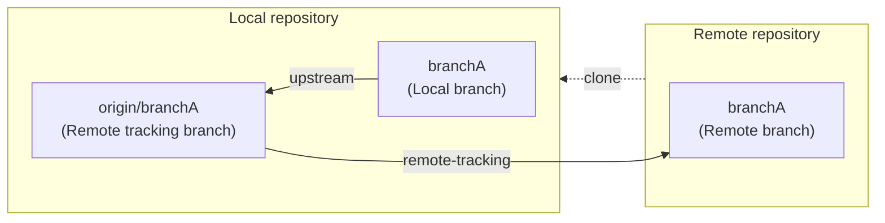

# Git Usage

## 目次
----------------------------------------
- [基本事項](#基本事項)
- [リモートリポジトリをローカルPCへクローン](#リモートリポジトリをローカルpcへクローン)
- [ローカルリポジトリにブランチ作成およびリモートリポジトリへのプッシュ](#ローカルリポジトリにブランチ作成およびリモートリポジトリへのプッシュ)
- [ブランチの削除](#ブランチの削除)
- [ローカルリポジトリへのコミット](#ローカルリポジトリへのコミット)
- [リモートブランチへのプッシュ](#リモートブランチへのプッシュ)
- [リモートリポジトリの更新をローカルリポジトリへ反映(上書き)](#リモートリポジトリの更新をローカルリポジトリへ反映上書き)
- [ローカルブランチの変更内容(未コミット)を引き継いで別ブランチに切り替える](#ローカルブランチの変更内容未コミットを引き継いで別ブランチに切り替える)
- [リベース](#リベース)
- [コンフリクトの解消](#コンフリクトの解消)


## 基本事項
----------------------------------------

- Remote repository：Github等のサーバ上にアップロードされているリポジトリ
- Local repository：ローカルPCに存在するリポジトリ
- クローン：すでに存在するリポジトリを異なるディレクトリにコピーすること
- ブランチ：独立した開発ライン
- branchA：Remote repositoryに存在するブランチ
- origin/branchA (Remote tracking branch)：Local repositoryに存在するブランチで、Remote repositoryのbranchAを追跡しているブランチ
- branchA (Local branch)：Local repositoryに存在するブランチで、origin/branchAを上流ブランチ(追跡対象)とするブランチ

※追跡とは、追跡対象の変更を全て取り込む前提とする、という意味。  
※origin=リモートリポジトリのアクセス先を示す名称(クローン時点で自動的に設定される)


## リモートリポジトリをローカルPCへクローン
----------------------------------------
1. リモートリポジトリをクローンしたいディレクトリに移動する。
    ```sh
    $ cd <clone_distination_directory>
    ```
2. クローンする。
    ```sh
    $ git clone <repository_url>
    ```
3. クローンしたフォルダに移動する。
    ```sh
    $ cd <cloned_repository>
    ```
4. ブランチ一覧を確認する。
    - ローカルリポジトリのブランチを一覧表示する。
        ```sh
        $ git branch
        ```
    - ローカル/リモートブランチを一覧表示する。
        ```sh
        $ git branch -a
        ```
        ※`*`がついているのがカレントブランチ。


## ローカルリポジトリにブランチ作成およびリモートリポジトリへのプッシュ
----------------------------------------
1.  現在のブランチから新規ブランチを作成する。
    ```sh
    $ git branch <new_branch>
    ```
2. 新規ブランチに移動する。
    ```sh
    $ git checkout <new_branch>
    ```
    - (1. 2. の代替)新規ブランチの作成と移動。
        ```sh
        $ git checkout -b <new_branch>
        ```
3. 新規ブランチをリモートリポジトリにプッシュする。
    ```sh
    $ git push origin <new_branch>
    ```


## ブランチの削除
----------------------------------------
- ローカルブランチの削除
    1. カレントブランチを削除対象外のブランチに切り替える。
        ```sh
        $ git checkout <other_branch>
        ```
    2. リモートブランチへマージ済みのブランチを削除する。
        ```sh
        $ git branch -d <delete_branch>
        ```
        or
        ```sh
        $ git branch --delete <delete_branch>
        ```
    3. マージされていないブランチも削除する。
        ```sh
        $ git branch -D <delete_branch>
        ```
- リモートブランチの削除
    1. リモート追跡ブランチの削除
        ```sh
        $ git branch -dr origin/<branch>
        ```
    2. リモートブランチの削除
        ```sh
        $ git push origin --delete <branch>
        ```


## ローカルリポジトリへのコミット
----------------------------------------
1. ローカルリポジトリに移動する。
    ```sh
    $ cd <local_repository>
    ```
2. ローカルリポジトリの状態を確認する。
    ```sh
    $ git status
    ```
3. add前に変更内容を確認する。
    ```sh
    $ git diff
    ```
    or
    ```sh
    $ git diff <file_path>
    ```
    ※新規追加ファイルの変更差分は見ることができないことに注意。
4. コミット対象ファイルをステージングエリアに登録(＝コミット対象の登録)する。
    - カレントディレクトリ配下のすべてのファイルを登録する場合
        ```sh
        $ git add .
        ```
    - 登録するファイルを個別に指定する場合
        ```sh
        $ git add <file_path1> <file_path2> ...
        ```
    - ステージングエリアから取り消す場合
        ```sh
        # 全ファイルの取り消し
        $ git reset HEAD
        ```
        or
        ```sh
        # 特定ファイルの取り消し
        $ git reset HEAD <file_path>
        ```
5. add後に変更内容を確認する。
    ```sh
    $ git diff --cached
    ```
    or
    ```sh
    $ git diff --cached <filepath>
    ```
    ※新規追加ファイルの変更差分も見ることができる。
6. コミットする。
    ```sh
    $ git commit
    ```
    or
    ```sh
    $ git commit -s # 署名を含める場合
    ```
7. 設定したエディタが開くので、コミットメッセージを記載する。
8. コミットログを確認する。
    ```sh
    $ git log
    ```


## リモートブランチへのプッシュ
----------------------------------------
1. リモートブランチへプッシュする。
    ```sh
    $ git push origin <branch>
    ```
    - Githubでプルリクエストを出した後に、再度リモートブランチへプッシュすると、プルリクエスト上にコミットが追加される。


## リモートリポジトリの更新をローカルリポジトリへ反映(上書き)
----------------------------------------
1. リモートリポジトリの最新の情報をローカルリポジトリから参照できるようにする。  
    (リモートブランチの状態をリモート追跡ブランチに取り込む)
    ```sh
    # 全てのリモートブランチをorigin/*として取り込む
    $ git fetch origin
    ```
    or
    ```sh
    # リモートの<branch>の状態をorigin/<branch>に取り込む
    $ git fetch origin <branch>
    ```
    ※ローカルブランチはまだ更新されていないことに注意。
2. 取り込んだコミットを確認する。
    ```sh
    $ git log origin/<branch>
    ```
3. リモートブランチをローカルのカレントブランチへ反映する。  
    (リモート追跡ブランチをローカルブランチに取り込む)  
    ※ローカルのカレントブランチを\<branch>にした状態(checkout)で以下を実行する。
    ```sh
    $ git merge origin/<branch>
    ```
※ローカルの変更差分を上書きしたくない場合は、[ローカルブランチの変更内容(未コミット)を引き継いで別ブランチに切り替え](#ローカルブランチの変更内容未コミットを引き継いで別ブランチに切り替える)の1.と3.の間に本手順を行うことで、ローカルブランチの変更差分を一時退避した後に取り込むことができる。


## ローカルブランチの変更内容(未コミット)を引き継いで別ブランチに切り替える
----------------------------------------
1. ローカルブランチの変更差分を一時退避する。
    ```sh
    $ git stash # untracked fileは退避されない
    ```
    or
    ```sh
    $ git stash -u  # untracked fileも含めて変更差分を退避
    ```
2. 現在のstashのリストを表示する。
    ```sh
    $ git stash list
    ```
3. 別のブランチに切り替える。
    ```sh
    $ git checkout <other_branch>
    ```
4. 一時退避していた変更差分を反映する(stashは反映後に削除される)。
    ```sh
    $ git stash pop
    ```


## リベース
----------------------------------------
マージ先ブランチに、自分のコミットの前提となるコミットがあり、
時系列的にそのコミットの後に自分のコミットを付け替えたいときに使用する。
自分のコミットが書き変わる(コミット履歴が変更される)ことに注意。
1. カレントブランチを、付け替えたい自分のコミットがあるブランチにする。
    ```sh
    $ git checkout <my_branch>
    ```
2. 自分のコミットの前提となるコミットが存在するリモートブランチ(通常はマージ先(≠プッシュ先))を指定してリベース。
    ```sh
    $ git pull --rebase origin <merge_branch>
    ```
3. リモートブランチにプッシュする。
    ```sh
    $ git push origin <my_branch>
    ```
    ※コミット履歴の変更により、プッシュに失敗する場合がある。その場合は、`git push -f`で強制プッシュすることになるが、注意が必要。
4. Githubで、origin/<my_branch>をorigin/<merge_branch>にマージするプルリクエストを出す。

※参考：[git pull と git pull –rebase の違いって？図を交えて説明します！](https://kray.jp/blog/git-pull-rebase/)


## コンフリクトの解消
----------------------------------------
- コンフリクトの編集をしていない場合にマージ前の状態に戻す。
    ```sh
    $ git merge --abort
    ```
- コンフリクトの編集をした場合にマージ前の状態に戻す。
    ```sh
    $ git reset --hard HEAD
    ```
